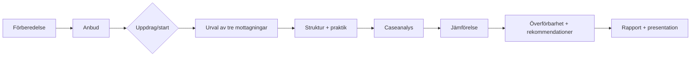

# Projektdashboard

**Senast uppdaterad:** 22 september 2026  
**Fas:** Förberedelse inför anbud

Det här är den publika lägesbilden av arbetet. Den visar vad som är etablerat, vad som utvecklas och vilka steg som ännu inte har öppnats.

## Nuvarande läge

| Område | Status | Kort lägesbild |
|---|---|---|
| Uppdragsförståelse | Etablerad | uppdragets DNA, ramar och avgränsning finns |
| Mottagningslandskap | Etablerat / levande | arbetsregister och urvalsmetod finns; slutliga tre är inte valda |
| Urvalsmodell | Etablerad | Register → Grundkrav → Relevans → Palett → RFSU-dialog |
| Analysmodell | Etablerad / förfinas | struktur + praktik + mekanism + överförbarhet |
| Metod och arbetsprocess | Under förfining | översätts till slutlig proposal/anbudsform |
| Proposal/anbud | Under arbete | aktuell huvudaktivitet |
| Genomförande i tre case | Ej startat | öppnas först efter eventuellt uppdrag/start |
| Rapport/resultat | Ej startat | beror på genomförda case |
| Visuellt material | Under utveckling | process- och dashboardbilder tas fram |

## Processbild

## Viktiga metodprinciper

- de tre mottagningarna ska inte presenteras som representativa för hela Sverige;
- urvalet görs tillsammans med RFSU;
- offentlig information används för orientering och screening, inte som bevis på hur en verksamhet faktiskt arbetar;
- samma grundstruktur används för att kunna jämföra de tre fallen;
- överförbarhet beskrivs tillsammans med villkor och begränsningar.

## Nästa publika kontrollpunkt

Nästa större statusförändring sker när anbudet är färdigställt eller när uppdragets start/fortsättning är beslutad.
