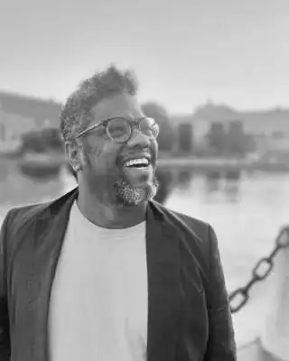
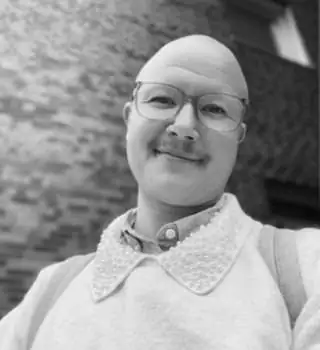

# Form & Flöde och konsultteamet

**Form & Flöde arbetar med organisations- och processutveckling i offentlig sektor, civilsamhälle och tvärsektoriella sammanhang.** I RFSU-uppdraget används den kompetensen för att följa hur strukturella villkor och faktisk praktik tillsammans formar möjligheten till relevant och jämlik SRHR-vård.

[**Läs om Form & Flöde →**](form-och-flode.md)

---

## Linus Fast

**Strategisk processdesigner · Grundare av Form & Flöde · Uppdragsansvarig konsult**

**Linus Fast arbetar med organisations- och processutveckling, systemanalys, strategi, utvärdering och MEAL, facilitering, kvalitativ analys och kunskapsöversättning.** Erfarenheten omfattar bland annat Rädda Barnen, Sensus/Malmö Tillsammans, Barnombudet i Uppsala län och konsult- och utvecklingsuppdrag inom offentlig sektor och civilsamhälle.

I RFSU-uppdraget leder Linus arbetet och ansvarar för metod- och analysarkitektur, urvalsprocess, projektkontroll, strukturell analys, jämförbarhet mellan fall, syntes, rapportering och slutleverans.

[**Linus profil →**](linus-fast.md) · [**CV →**](cv/linus-fast-fullstandigt-cv-rfsu.md)

---

## AD

**Senior konsult**

**AD har erfarenhet av processledning, normkritisk och intersektionell organisationsutveckling samt arbete i vård- och fertilitetsnära sammanhang.** AD:s dokumenterade erfarenhet omfattar användarcentrerade flöden och multiprofessionell samverkan inom fertilitetsområdet, jämlik vård och makt i vårdsammanhang samt publicerad analys inom transspecifik hälso- och sjukvård.

AD medverkar som senior konsult i genomförandet av uppdraget utifrån de behov som uppstår genom processen. AD:s kompetens används i processledning, kvalitativt arbete, jämlikhets- och normkritisk analys, vård- och fertilitetsnära frågor, gemensam analys, rekommendationsarbete samt återföring och erfarenhetsutbyte.

[**AD:s profil →**](adrian-repka.md) · [**CV →**](cv/adrian-repka-fullstandigt-cv-rfsu.md)

---

## Teamet i uppdraget

**Linus och AD utgör ett litet seniort konsultteam med tydligt uppdragsansvar och flexibel användning av kompetens.** Linus håller samman uppdragets arkitektur och slutleverans. AD medverkar genom hela genomförandet där AD:s kompetens skapar värde för uppdraget.
