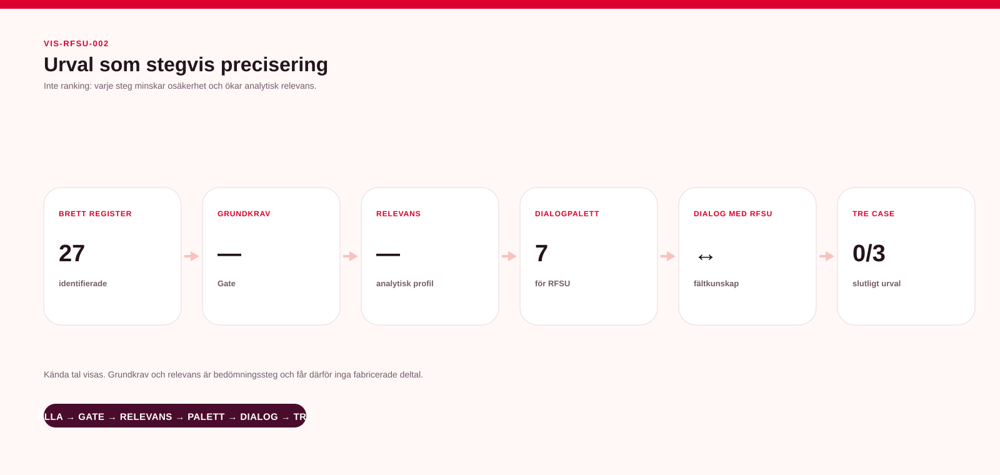
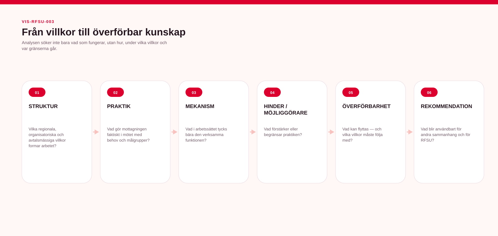
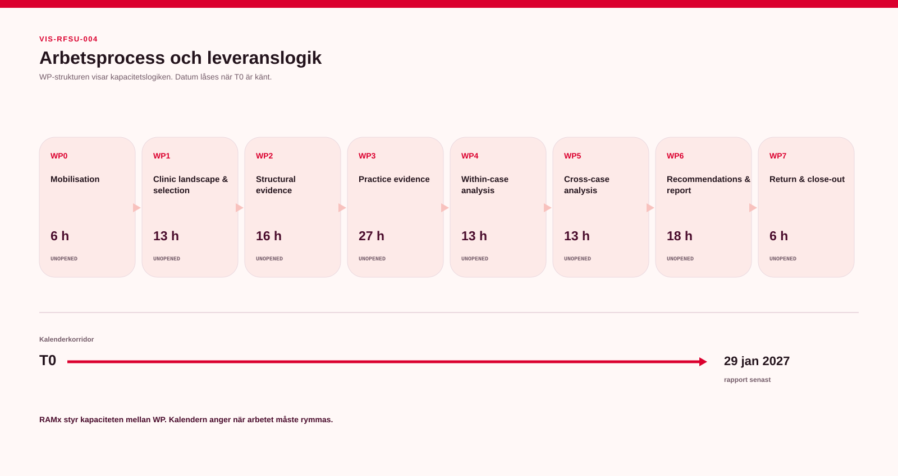

# 09 — Visuellt material

## Projektdashboard

[Öppna dashboardens textvy](../05-lagesbild/projektdashboard.md)

## Uppdraget i korthet

[Textalternativ och förklaring](uppdraget-i-korthet.md)

## Urvalsprocess

**Brett register → Grundkrav → Relevans → Dialogpalett → Dialog med RFSU → Tre case**

Kända antal visas i bilden. Grundkrav och relevans är bedömningssteg och får därför inga fabricerade deltal.

## Analysmodell

**Struktur → Praktik → Mekanism → Hinder/möjliggörare → Överförbarhet → Rekommendation**

## Arbetsprocess

WP-strukturen visar leverans- och kapacitetslogiken. Exakta kalenderdatum låses först när uppdragets T0 är känt.

## Design- och dataprincip

Alla fem kärnvisualer genereras från samma projektmodell. De ska inte handredigeras.

Om en visualisering och det källkontrollerade textunderlaget skulle skilja sig åt är textunderlaget styrande tills nästa automatiska build har korrigerat bilden.
