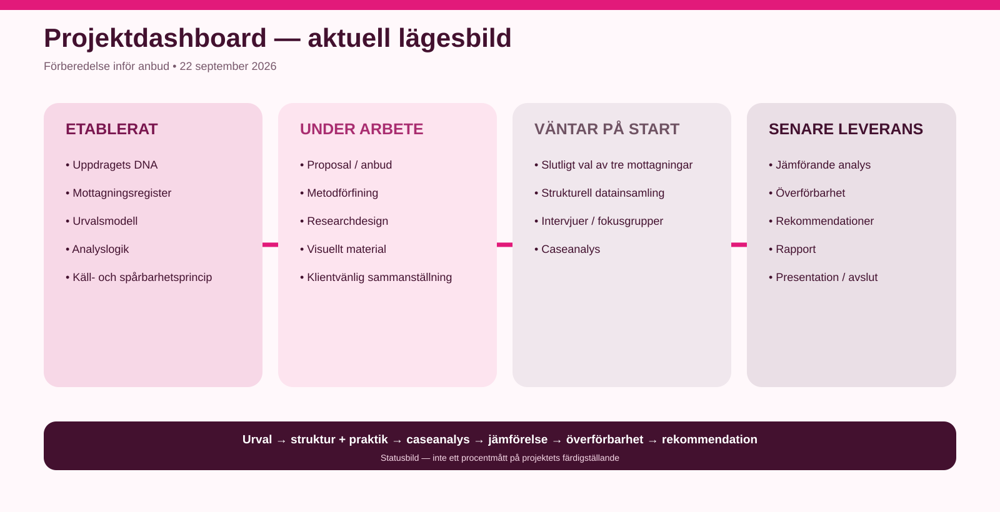

# 09 — Visuellt material

Här samlas infografik, processbilder och andra visuella förklaringar av uppdraget.

Syftet är att göra uppdragets logik lättare att förstå utan att läsaren först behöver gå igenom alla metod- och arbetsdokument.

## Pågående material

### VIS-RFSU-001 — Uppdraget i korthet
En samlad översikt över:
- syfte;
- vad som undersöks;
- urval av mottagningar;
- genomförande;
- ramar och leveranser.

[Öppna presentationssidan](uppdraget-i-korthet.md)

### VIS-RFSU-002 — Urvalsprocess
Planerad visualisering av:

**Register → Grundkrav → Relevans → Palett → Dialog med RFSU → Tre mottagningar**

### VIS-RFSU-003 — Analysmodell
Planerad visualisering av:

**Strukturella villkor → Faktiskt arbetssätt → Verksam mekanism → Hinder/möjliggörare → Överförbarhet → Rekommendation**

### VIS-RFSU-004 — Uppdragets arbetsprocess
Planerad.

## Princip

Visualiseringarna är förenklingar av det mer detaljerade arbetsunderlaget. Om en bild och den källkontrollerade texten skiljer sig åt är det textunderlaget som är styrande.

### VIS-RFSU-005 — Projektdashboard
Visuell lägesbild över förberedelse, aktiva arbetsdelar och kommande genomförandefaser.

