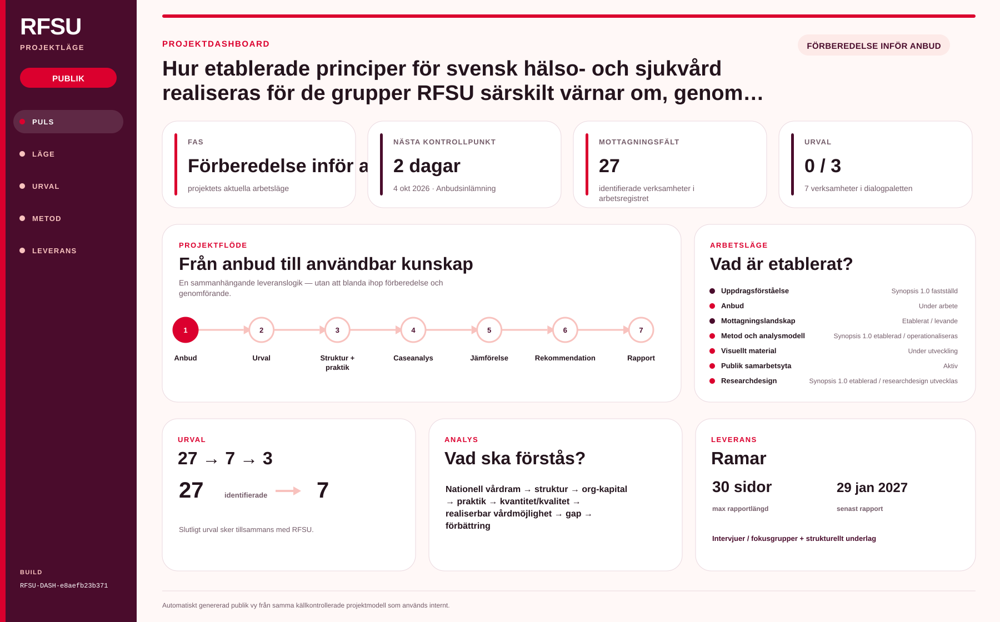
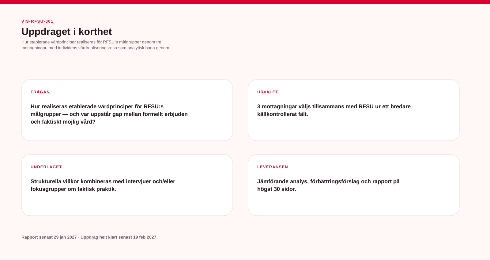
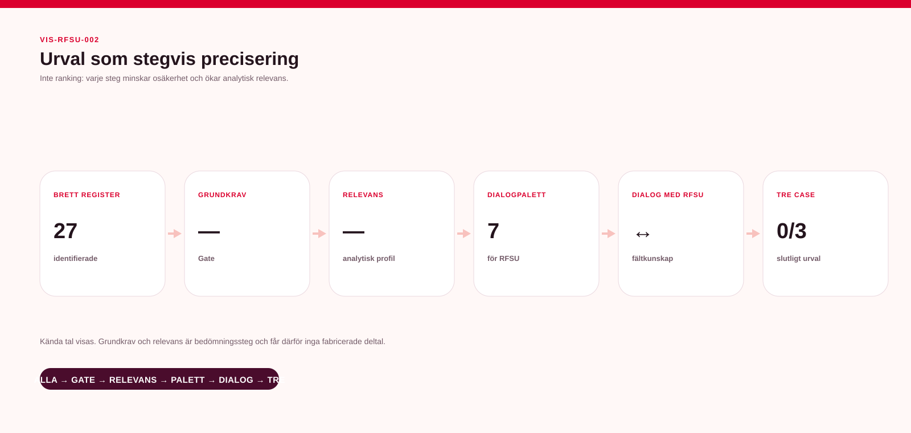
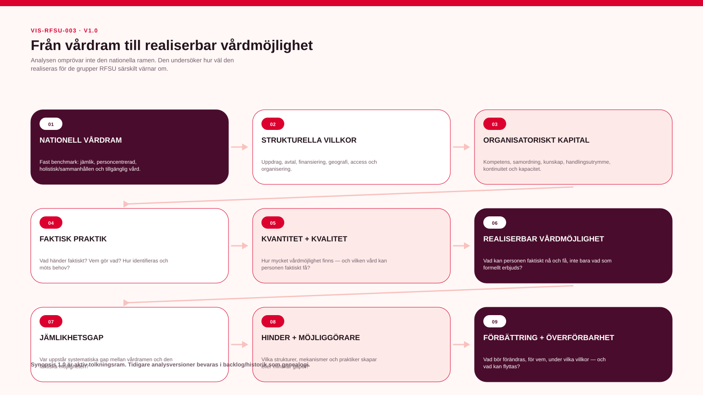
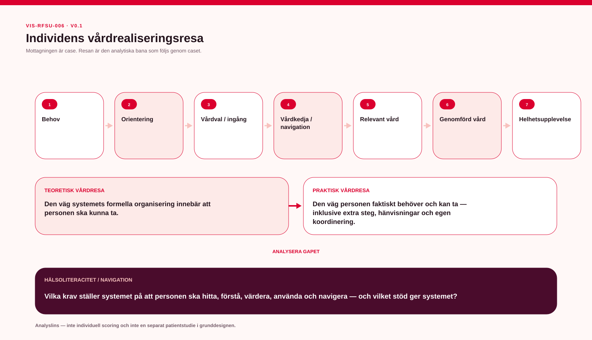
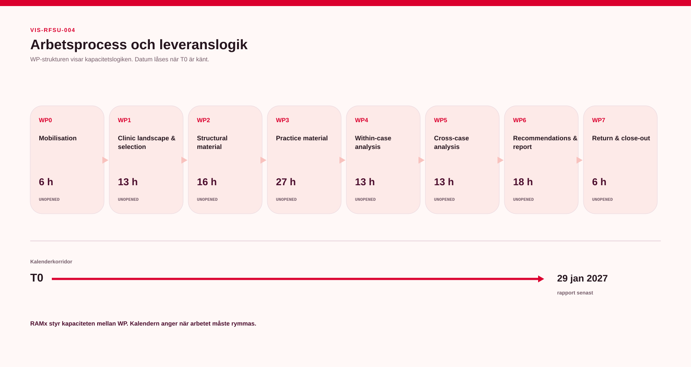

# 09 — Visuellt material

## Uppdragsdesign 2.0 — Proposal 2.0

[**Textalternativ och förklaring**](uppdragsdesign-v2.0.md)

Den här visualen visar hur hela uppdraget är konstruerat: gemensam vårdram, tre mottagningar, gemensam materialarkitektur, vårdrealiseringsresa, fallanalys, tvärgående syntes, rekommendationer, genomförande och team.

## Projektdashboard

[Öppna dashboardens textvy](../05-lagesbild/projektdashboard.md)

## Uppdraget i korthet

[Textalternativ och förklaring](uppdraget-i-korthet.md)

## Urvalsprocess

**Brett register → Grundkrav → Relevans → Dialogpalett → Dialog med RFSU → Tre fall**

## Analysmodell 1.1

**Nationell vårdram → realiseringssystem → individens vårdrealiseringsresa → realiserbar vårdmöjlighet → gap → förbättring/överförbarhet**

## Individens vårdrealiseringsresa

**Behov → orientering → vårdval/ingång → vårdkedja/navigation → relevant vård → genomförd vård → helhetsupplevelse**

Hälsoliteracitet och navigation används som en relationell gränssnittslins genom resan.

## Arbetsprocess

Arbetsprocessen omsätter analysarkitekturen i ett proportionerligt genomförande med tre fall, strukturellt material och ett primärt empiriskt block per fall.

## Design- och dataprincip

Visualerna ska hållas i linje med det källkontrollerade textunderlaget. Proposal 2.0 och Synopsis 1.1 är styrande för uppdragsdesignen.
