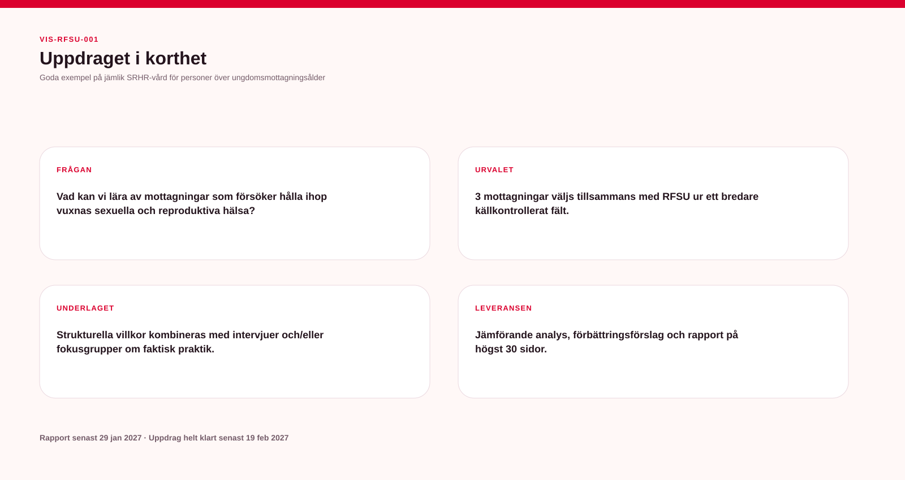

# Uppdraget i korthet — visuell översikt

**VIS-RFSU-001 / GENERATED**

Bilden sammanfattar uppdragets fyra kärnor:

**Frågan:** vad går att lära av verksamheter som försöker hålla ihop vuxnas sexuella och reproduktiva hälsa?

**Urvalet:** tre mottagningar väljs tillsammans med RFSU ur ett bredare, källkontrollerat fält.

**Underlaget:** strukturella villkor kombineras med intervjuer och/eller fokusgrupper om faktisk praktik.

**Leveransen:** jämförande analys, förbättringsförslag, rapport och presentation inom uppdragets ramar.

## Kärnlogiker

**Urval:** Brett register → Grundkrav → Relevans → Palett → Dialog med RFSU → Tre mottagningar

**Analys:** Strukturella villkor → Faktisk praktik → Verksam mekanism → Hinder/möjliggörare → Överförbarhet → Rekommendation

Visualiseringen genereras automatiskt och ska inte redigeras separat från projektmodellen.
