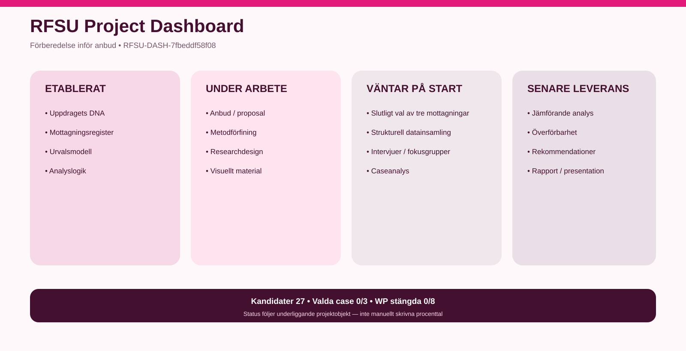

# RFSU Godex

[**Öppna projektdashboarden**](05-lagesbild/projektdashboard.md) · [Urvalsprocess](09-visuellt-material/assets/urvalsprocess.svg) · [Analysmodell](09-visuellt-material/assets/analysmodell.svg) · [Arbetsprocess](09-visuellt-material/assets/arbetsprocess.svg)

> **Aktuell lägesbild först.** Dashboarden ovan genereras från samma källkontrollerade projektstatus som används i den interna projektstyrningen.

Det här är den publika arbets- och kommunikationsytan för uppdraget om goda exempel på jämlik SRHR-vård för vuxna efter ungdomsmottagningsålder.

## Så uppdateras lägesbilden

~~~text
intern projektstatus
        ↓
automatisk validering
        ↓
sensemaking / härledning
        ↓
RFSU-profilerad dashboard
        ↓
publik whitelist
        ↓
den här samarbetsytan
~~~

Den publika projektionen innehåller inte intern RAMx-detalj, kommersiella uppgifter, interna risker eller intern metodstyrning.

## Innehåll

**01 — Uppdraget** beskriver ramar och uppdragsförståelse.  
**02 — Arbetsprocessen** visar hur genomförandet hänger ihop.  
**03 — Val av mottagningar** visar register, urvalsprincip och dialogpalett.  
**04 — Analysmodellen** visar hur struktur kopplas till praktik, mekanism och överförbarhet.  
**05 — Lägesbild** innehåller den kanoniska dashboarden.  
**06 — Resultat** används när stabila resultat finns.  
**07 — Leveranser** samlar rapport och presentation.  
**08 — Källor** håller den publika spårbarheten.  
**09 — Visuellt material** samlar genererade projektbilder.

## Två centrala logiker

**Urval:** Alla → Gate → Relevans → Palett → Dialog med RFSU → Tre mottagningar

**Analys:** Strukturella villkor → faktisk praktik → verksam mekanism → hinder/möjliggörare → överförbarhet → rekommendation

## Public-by-design

Intervjurådata, personuppgifter, konfidentiella dokument, känsliga arbetsanteckningar och intern kommersiell planering publiceras inte här.
