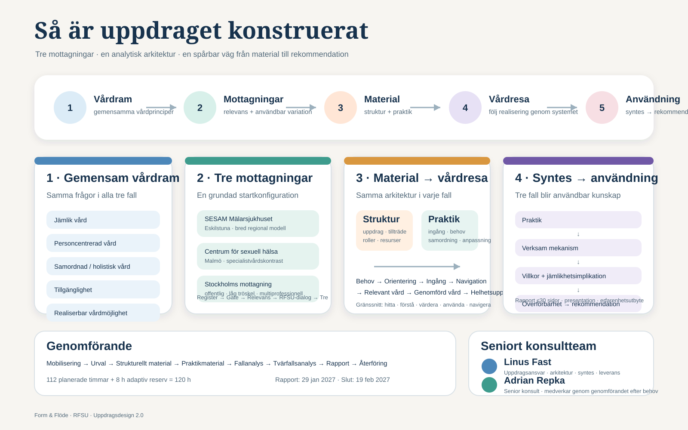

# RFSU Godex — kartläggning av jämlik SRHR-vård

[**Anbud**](11-anbud/officiellt-anbudsutkast-v1.0.md) · [**Uppdragsdesign**](09-visuellt-material/uppdragsdesign-v2.0.md) · [**Konsultteam**](10-konsultprofil/README.md) · [**Uppdraget**](01-uppdraget/README.md) · [**Arbetsprocess**](02-arbetsprocessen/README.md) · [**Val av mottagningar**](03-val-av-mottagningar/README.md) · [**Analysmodell**](04-analysmodellen/README.md) · [**Källor**](08-kallor/README.md)

**Den här samarbetsytan samlar Form & Flödes förslag till RFSU:s kartläggning och analys av goda exempel på jämlik SRHR-vård för personer över ungdomsmottagningsålder.** Här går det att följa uppdragsförståelsen, urvalet av mottagningar, arbetsprocessen, analysmodellen, konsultteamet och anbudet i ett sammanhållet flöde.

## Uppdragsdesign

**Tre mottagningar följs genom samma analytiska arkitektur för att göra både skillnader och gemensamma mönster jämförbara.** Arbetet rör sig från gemensamma vårdprinciper och strukturella villkor till faktisk praktik, individens väg genom vården och de mekanismer som skapar relevant och jämlik vård.

> **Gemensam vårdram → tre ändamålsenligt varierade fall → gemensam materialarkitektur → vårdrealiseringsresa → standardiserad fallanalys → tvärgående mekanismanalys → rekommendationer och överförbarhet**

[**Läs uppdragsdesignen →**](09-visuellt-material/uppdragsdesign-v2.0.md)

## Föreslagna mottagningar

**Urvalet byggs för att ge tre relevanta verksamheter med användbar variation i organisatorisk placering, regional kontext, uppdrag och tillträdeslogik.** Form & Flöde går in i dialogen med RFSU med följande startkonfiguration:

1. **SESAM Mälarsjukhuset, Eskilstuna**
2. **Hudmottagning Centrum för sexuell hälsa, Malmö**
3. **Stockholms mottagning för sexuell hälsa**

Den slutliga konfigurationen fastställs tillsammans med RFSU vid mobilisering.

[**Läs om urvalet →**](03-val-av-mottagningar/README.md)

## Konsultteam

**Linus Fast leder uppdraget och håller samman metod, analys, projektstyrning, syntes och slutleverans.** Adrian Repka medverkar som senior konsult i genomförandet utifrån de behov som uppstår genom processen.

Teamet kombinerar organisations- och processutveckling, utvärdering och kvalitativ analys med dokumenterad erfarenhet av jämlikhetsfrågor, vård- och fertilitetsnära arbete samt normkritiska och intersektionella perspektiv.

[**Möt Form & Flöde, Linus och Adrian →**](10-konsultprofil/README.md)

## Så hänger materialet ihop

**Uppdraget** beskriver frågan och de ramar som styr arbetet. **Arbetsprocessen** visar hur material samlas in och utvecklas till tre jämförbara fall. **Val av mottagningar** visar urvalslogiken. **Analysmodellen** visar hur struktur, praktik och vårdrealiseringsresa kopplas samman. **Källor** samlar den publika spårbarheten. **Anbudet** för samman helheten i det erbjudande som lämnas till RFSU.

[**Öppna anbudet →**](11-anbud/officiellt-anbudsutkast-v1.0.md)
